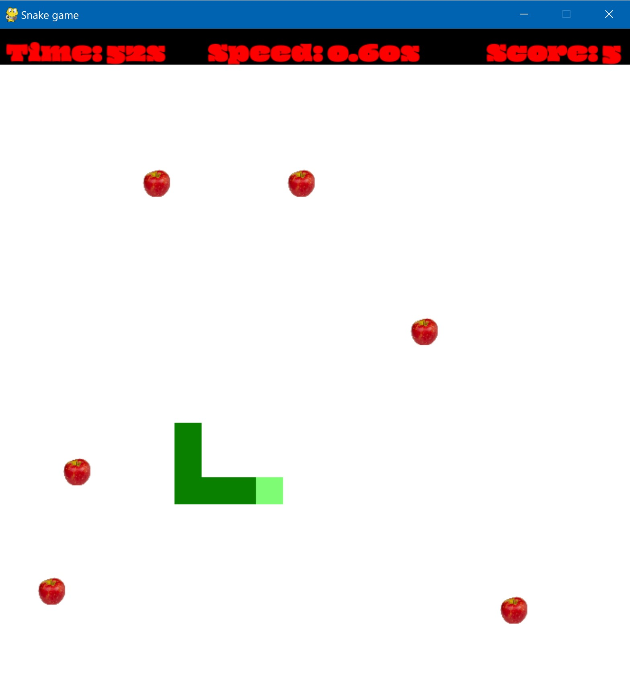

# 🐍 Snake Game

A classic Snake game implemented in python!     
Use the arrow keys to control the snake and eat apples to grow longer.   

  

🎮 **How to Play**

Use the arrow keys:     
⬆️ Up | ⬇️ Down | ⬅️ Left | ➡️ Right   
By default, the snake moves automatically every 0.5 seconds.    
Every 5 seconds, a new fruit appears on the board.     
Eat apples to grow longer and try not to run into the edges.    

⚡ **Control the Speed**

You can change the snake’s speed while playing:      
➕ Press `+` to make the snake move **faster**     
➖ Press `-` to make the snake move **slower**     
Use this to challenge yourself or take it easy!     

🚀 **Getting Started** 
```bash    
git clone https://github.com/MichalRapoport/snake.git      
cd snake            
python ./src/main.py
```        
<sub> 🐍 Make sure you have Python installed </sub>
